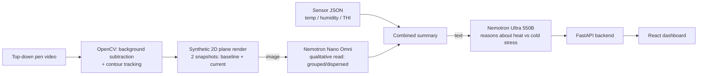

# PigWatch — Demo Overview

## What this is

PigWatch is an early-warning system for thermal stress in pigs. It watches a
top-down pen video, reads environmental sensors (temperature/humidity), and
uses two LLMs to reason about whether the pigs are at risk of heat stroke or
cold stress — then produces a plain-language report with a recommended
action, instead of a human having to notice the problem manually.

## The demo narrative

The clip shows pigs starting **dispersed** around the pen. Partway through, a
loud noise startles them and they **group together** — normal pig behavior,
not inherently a problem. But the sensor data for this scenario shows a hot,
humid environment (~30°C, ~80%+ humidity). The combination is the point:
huddling traps body heat and blocks airflow, so grouping that would be
harmless on a mild day becomes a real heat stroke risk factor.

The system is built to catch exactly this: it doesn't just read the
temperature, and it doesn't just read pig posture — it combines both, and the
model is explicitly told that grouping while it's already hot is a danger
sign, not a comfort signal. Expect the live report to come back
**CRITICAL/WARNING**, citing the heat+humidity+grouping combination, and
recommending immediate ventilation/cooling.

## How it works

1. **Detection & tracking** (`pig_tracking_pipeline.py`): OpenCV samples the
   video every second, uses background subtraction (MOG2) + contour
   detection to find pig positions, and tracks them across frames. This
   runs continuously so the background model stays accurate — but only 2
   moments are used downstream: the earliest usable frame (baseline) and
   the final frame (current state).
2. **Vision reasoning**: those 2 moments are rendered as clean synthetic
   top-down plots (not the raw camera frame) and sent to **Nemotron Nano
   Omni** (via Crusoe), which gives a qualitative read — grouped/dispersed,
   and a possible concern — rather than re-deriving coordinates it doesn't
   need to touch.
3. **Sensor analysis** (`pig_stress_monitor.py`): temperature/humidity/THI
   readings over the same window are reduced to trends (rising/falling,
   by how much).
4. **Welfare reasoning**: the vision reading + sensor trends are combined
   into one compact summary and sent to **Nemotron Ultra 550B** (also via
   Crusoe), which reasons freely about cold-stress vs. heat-stress signals
   and returns a structured 4-line verdict: STATUS / WHAT'S HAPPENING /
   LIKELY CAUSE / RECOMMENDED ACTION.
5. **Serving it**: a small FastAPI backend (`backend_app.py`) wraps all of
   the above behind two endpoints — `POST /run` (runs the full pipeline)
   and `GET /report` (returns the last result) — so the frontend doesn't
   need to know anything about OpenCV or the model calls.
6. **Displaying it**: a React dashboard shows the sensor trends, both
   vision readings, and the Ultra report with a color-coded status badge
   (green → red).

## Tech stack

| Layer | Choice |
|---|---|
| Computer vision | Python, OpenCV (MOG2 + contours), NumPy, Matplotlib |
| Vision LLM | Nemotron Nano Omni (qualitative spatial read) |
| Reasoning LLM | Nemotron Ultra 550B (welfare verdict) |
| LLM hosting | Crusoe Cloud (OpenAI-compatible inference API) |
| Backend | FastAPI (Python), systemd service |
| Backend hosting | Vultr Cloud Compute VM (Ubuntu 22.04) |
| Secure exposure | Cloudflare Tunnel (`cloudflared`), no open inbound ports |
| Domain | `cwco.tech` (OVHcloud registrar, DNS delegated to Cloudflare) |
| Frontend | React + Vite |
| Frontend hosting | Cloudflare Pages |
| Source control | GitHub ([Come404/pig_monitor](https://github.com/Come404/pig_monitor)) |

## Status as of writing

- Backend, tracking pipeline, and both LLM calls: **working end-to-end**,
  verified live.
- Named Cloudflare Tunnel at `api.cwco.tech`: **live**, still finishing DNS
  propagation on some networks (expected to clear before the demo).
- React dashboard: **built and tested** against the live backend, not yet
  deployed to Cloudflare Pages.
- Sensor data for the demo is a **synthetic fixture** (`sensors_sample.json`)
  matching the intended hot/humid scenario, not a real sensor feed.
