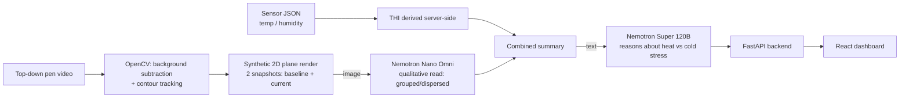

# PigWatch

Early-warning system for thermal stress in pigs. Reads a top-down pen video
and environmental sensor data (temperature/humidity), derives THI
server-side, and uses two LLMs (via Crusoe Cloud) to reason about heat vs.
cold stress risk — producing a plain-language report instead of requiring a
human to notice the problem manually.

Built for a live demo at the **SPACE trade show**, Rennes, 15–17 September
2026.

For the demo narrative and full architecture walkthrough, see
[`DEMO.md`](DEMO.md). For a detailed engineering handoff (what each script
does, known issues), see [`PROJECT_STATE.md`](PROJECT_STATE.md) — note that
document predates the current AWS deployment and describes an earlier
Vultr/Cloudflare Tunnel setup; treat this README and [`infra/`](infra) as the
source of truth for how the app is actually deployed today.

## How it works



1. **Detection & tracking** (`pig_tracking_pipeline.py`) — OpenCV (MOG2 +
   contours) tracks pig positions across the video; two moments (baseline,
   current) are rendered as clean synthetic top-down plots.
2. **Vision reasoning** — those two plots go to **Nemotron Nano Omni** (via
   Crusoe), which returns a qualitative read (grouped/dispersed + possible
   concern).
3. **Sensor analysis** (`pig_stress_monitor.py`) — temperature/humidity
   trends over the same window; THI (Xin & Harmon 1998) is calculated
   server-side, never sent pre-computed from the edge.
4. **Welfare reasoning** — vision + sensor summary goes to **Nemotron Super
   120B** (also via Crusoe), which returns a structured 4-line verdict:
   STATUS / WHAT'S HAPPENING / LIKELY CAUSE / RECOMMENDED ACTION.
5. **Serving it** — `backend_app.py` (FastAPI) wraps all of the above behind
   `POST /run` and `GET /report`.
6. **Displaying it** — `webapp/` (React + Vite) shows sensor trends, both
   vision readings, and the Ultra report with a color-coded status badge.

## Repository layout

```
pig_tracking_pipeline.py   # detection + tracking + Nano Omni orchestration
pig_stress_monitor.py      # sensor analysis + Ultra call + CLI dashboard
backend_app.py              # FastAPI wrapper exposing the pipeline over HTTP
requirements.txt            # core deps (opencv/numpy/matplotlib/openai/rich)
requirements-server.txt     # requirements.txt + fastapi + uvicorn
sensors_sample.json         # synthetic sensor fixture for the demo
pigs_top_down.mp4           # demo video (top-down pig pen, ~5s)
Dockerfile                  # container image used by the AWS deploy
webapp/                     # React (Vite) frontend
infra/                      # AWS CDK app (ECR, VPC, ECS Fargate, ALB, RDS)
```

## Tech stack

| Layer | Choice |
|---|---|
| Computer vision | Python, OpenCV (MOG2 + contours), NumPy, Matplotlib |
| Vision LLM | Nemotron Nano Omni (qualitative spatial read) |
| Reasoning LLM | Nemotron Super 120B (welfare verdict) |
| LLM hosting | Crusoe Cloud (OpenAI-compatible inference API) |
| Backend | FastAPI (Python) |
| Backend hosting | AWS ECS Fargate, behind an Application Load Balancer, `eu-west-3` |
| Database | RDS Postgres (`db.t4g.micro`), provisioned but not yet wired into the app |
| Secrets | AWS Secrets Manager (DB credentials, `CRUSOE_API_KEY`) |
| Container registry | AWS ECR |
| IaC | AWS CDK (TypeScript), see `infra/` |
| Frontend | React + Vite |
| Source control | GitHub ([Come404/pig_monitor](https://github.com/Come404/pig_monitor)) |

## Running locally

```bash
python -m venv .venv
.venv/Scripts/activate      # or source .venv/bin/activate on macOS/Linux
pip install -r requirements-server.txt

export CRUSOE_API_KEY=...   # required — no default, never commit this
uvicorn backend_app:app --host 0.0.0.0 --port 8000
```

Then `GET http://localhost:8000/health` and `POST http://localhost:8000/run`.

Frontend:

```bash
cd webapp
npm install
npm run dev
```

## Deployment

The app runs on AWS (ECS Fargate + ALB + RDS Postgres, `eu-west-3`), defined
as CDK in [`infra/`](infra). See that directory for the stack layout and the
exact build/push/deploy command sequence.
